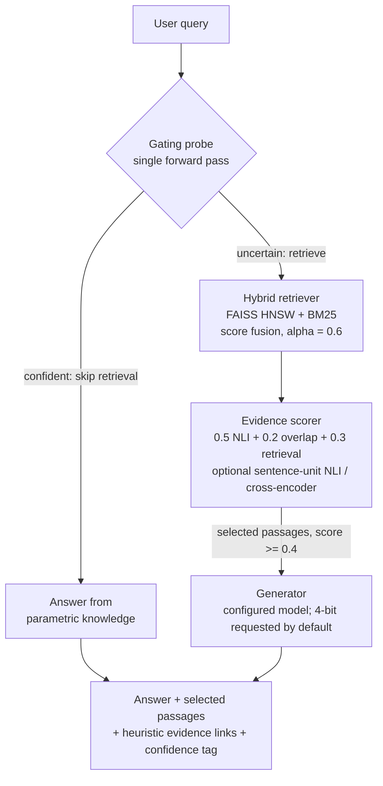

# Factuality-First RAG

**Current implementation: incumbent `I0` adaptive retrieval gating + passage-level evidence scoring.** The repository implements a Retrieval-Augmented Generation pipeline that uses generator uncertainty to decide *whether* to retrieve, then ranks retrieved passages for query relevance before generation. A separate BM25-first successor study is proposed but is not yet implemented, protocol-frozen, or validated.

[](https://www.python.org/downloads/)
[](LICENSE)


---

## Motivation

Many conventional RAG pipelines retrieve for every query. That can add compute and latency and can expose generation to irrelevant or contradictory context. Some pipelines also do not separately assess whether the retrieved evidence supports the answer.

The current incumbent implementation, designated `I0` in the research protocol, attacks both problems with two ideas:

1. **Adaptive retrieval gating** — a probe on the generator's own next-token distribution that decides whether retrieval is needed, so the system can skip it on confident, parametric-knowledge queries. Its latency and net compute benefit remain to be measured under the frozen protocol.
2. **Passage-level evidence scoring** — every retrieved passage is scored against the query with an NLI entailment signal *before* generation. Because the hypothesis is the query rather than an answer claim, this is a query–passage evidence/relevance signal, not a factuality judgment.

The gating probe reads signals from the same model used for generation and needs no separately trained gate. Whether the extra probe pass reduces end-to-end latency depends on the retrieval rate and serving setup and is an open measurement question.

---

## How the current incumbent works

`I0` runs in four stages and returns an answer, selected passages, heuristic sentence-unit-to-passage evidence links under the compatibility field name `provenance`, and a qualitative confidence tag. The links are model-derived rather than human-adjudicated provenance, and the tag is not a calibrated probability. This is the incumbent baseline, not the planned successor controller.

**1. Gating probe.** The probe examines the entropy and the top-two logit gap of the generator's next-token distribution. The default one-position probe uses one forward pass. When the model is confident — low entropy *and* a wide logit gap — the pipeline skips retrieval and answers from parametric knowledge. When it is uncertain (`entropy > 1.2` **or** `logit_gap < 2.0`), the pipeline retrieves. Setting `probe_tokens > 1` performs one autoregressive forward pass per probed position and averages the signals.

**2. Hybrid retriever.** Dense (FAISS HNSW over `all-mpnet-base-v2` embeddings) and sparse (Lucene BM25 via Pyserini) results are fused with per-query min-max normalisation and a tunable weight: `combined = α·dense + (1−α)·BM25`, with `α = 0.6` by default.

**3. Passage scorer.** Each candidate passage gets an evidence score that fuses query–passage entailment, lexical overlap, and retrieval strength: `score = 0.5·P(entailment) + 0.2·overlap + 0.3·ret_norm`, where the passage is the NLI premise and the query is the hypothesis. `ret_norm` is recomputed across the candidate set from the retriever's combined score; when all candidate scores tie, it is `0.5`. Only passages scoring `≥ 0.4` are passed forward. The optional regex sentence-unit mode takes the maximum NLI score across heuristic units; the optional cross-encoder reorders the complete retrieved list without truncating it.

**4. Generator.** Real-mode loading requests 4-bit Mistral-7B-Instruct-v0.3 by default. With surviving passages it generates from an `[INST]` contextual prompt; after a gate skip or an empty filter result it still generates from a no-context prompt. Cited-or-abstain behavior is not implemented. Missing quantization dependencies fail closed; there is no automatic full-precision fallback. Compatible gating and generation requests share the cached model through a singleton registry.



<details>
<summary><b>Detailed data flow</b> — text diagram with the exact thresholds and formulas</summary>

```
User Query
    │
    ▼
┌─────────────────────────┐
│   GATING PROBE          │  entropy > 1.2 OR logit_gap < 2.0 → RETRIEVE
│   (single forward pass) │  else → SKIP (parametric answer)
└────────┬────────────────┘
         │ retrieve=True
         ▼
┌─────────────────────────┐
│  HYBRID RETRIEVER       │  combined = α·dense + (1−α)·BM25   (α=0.6)
│  FAISS HNSW + Pyserini  │  per-query min-max normalisation
└────────┬────────────────┘
         │ top-K passages
         ▼
┌─────────────────────────┐
│  EVIDENCE SCORER        │  score = 0.5·P(ent) + 0.2·overlap + 0.3·ret
│  NLI + token overlap    │  premise=passage, hypothesis=query
│  Sentence-unit NLI      │  (optional: regex split, max unit score)
│  Cross-encoder rerank   │  (optional: reorder full list before NLI)
└────────┬────────────────┘
         │ selected passages (score ≥ 0.4)
         ▼
┌─────────────────────────┐
│  GENERATOR              │  configured model (4-bit requested by default)
│  model_registry shared  │  [INST] RAG prompt template
└────────┬────────────────┘
         │
         ▼
   (answer, selected passages, heuristic evidence links, confidence_tag)
```

> The gating probe and generator request weights through a singleton `model_registry`; compatible requests reuse the same cached object instead of independently loading a second copy during the pipeline lifetime.

</details>

### Planned successor — not yet implemented

The approved study direction is a sequential BM25-first controller. `F1` runs only BM25; deterministic policy `A1` either stops with cited `F1` evidence or pays for the remaining dense, fusion, and passage-filtering work needed for fixed hybrid `F2`. `V2` is evaluated separately as a verifier-confidence answer/abstain policy on one immutable set of `F2` outputs. Only if both component studies pass may conditional system `M` compose `A1` and `V2`, followed by its own end-to-end evaluation.

```text
query -> F1 (BM25) -> A1 decision -+-> stop with cited F1 evidence or abstain
                                   |
                                   +-> acquire F2 hybrid path

fixed F2 outputs -> generator-confidence policy vs V2 verifier-confidence policy

RQ1 pass + RQ2 pass -> build and separately evaluate candidate M
```

The existing hybrid retriever computes dense and sparse retrieval within one call, so setting its dense weight to zero would not implement the cost-saving `F1` stage. The sparse-first execution path, deterministic `A1` rule, joint-evidence verifier, and cited-or-abstain controller remain implementation and freeze work.

---

## Project status

I want to be upfront about where this stands, because it changes how to read what's below.

- 🧪 **Incumbent engineering foundation: implemented; current verification not claimed here.** Gating, passage evidence scoring, hybrid retrieval, baseline runners, and offline test code are present. No current passing-test or coverage count is asserted by this README. Publication-grade evaluator identity and sealed result artifacts remain open research gates; lexical overlap is never reported as FactScore.
- 🧪 **Local retrieval artifact: built, not shipped or frozen.** A machine-local development corpus and FAISS/Lucene indexes exist, but their snapshot and manifests are not protocol-frozen. The repository makes no reproducibility or benchmark claim for those excluded artifacts.
- 🔬 **Successor study: proposed, not implemented, and no results.** The private design draft covers conditional KILT migration, non-final pilots, protocol freezing, and the missing sequential-controller and verifier paths. Its first design gate has not passed. No confirmatory benchmark, efficiency, factuality, or safety result is claimed.

This README intentionally reports research-stage implementation status without
claiming unverified results.

---

## Evaluation design

The reduced study isolates sequential routing from verifier-assisted selective answering before testing any composed system.

**Current benchmark scaffolding.** Generic QA extraction paths are present for
NQ-Open, non-KILT HotpotQA, and 2WikiMultihopQA. FEVER, TruthfulQA, PopQA, and
HAGRID are disabled until task-specific prompts, metadata retention, and
evaluators exist. These loaders do not constitute KILT task support.

**Intended study data.** The successor targets exact KILT Natural Questions and
exact KILT HotpotQA against one pinned KILT knowledge snapshot. Migration is
conditional on release and license resolution plus 10k-, 100k-, and 1m-passage
feasibility gates; no bulk acquisition or full index build is authorized merely
by adopting the study direction.

| ID | Role in the reduced study | Current state |
|---|---|---|
| `D0` | Closed-book diagnostic only; never served | Existing mechanics; diagnostic |
| `F1` | Fixed BM25 cheap reference for RQ1; not the confirmatory comparator | Successor route not frozen |
| `F2` | Fixed hybrid route and sole direct comparator for RQ1; output source for RQ2 | Incumbent components exist; protocol route not frozen |
| `I0` | Existing entropy/logit-gap gate | Mandatory incumbent baseline; exploratory only |
| `A1` | Deterministic BM25-first policy that stops at `F1` or escalates to byte-equivalent `F2` | Not implemented; rule uses only `router_tuning` |
| `V2` | Joint-evidence verifier confidence on fixed `F2` outputs | Not implemented; RQ2 ranks at exact coverage, while an `M` serving threshold is separately calibrated |
| `M` | Conditional composition of frozen `A1` and `V2` | Blocked until both RQs pass; then requires separate end-to-end evaluation |
| `Oracle` | Cheapest successful route using labels unavailable at inference | Diagnostic upper bound only |

**RQ1 — sequential routing.** Compare `A1` directly with `F2` for non-inferiority
on equal-weight macro answer F1 and for reduced acquisition of the expensive
`F2` path. Report `F1`, `I0`, `D0`, and `Oracle` separately; none may replace
`F2` as the comparator after outcomes are observed.

**RQ2 — confidence policy.** On the exact same sealed `F2` retrieval,
generation, answer, and citation outputs, compare generator confidence with
`V2` verifier confidence at exactly matched empirical top-`q` answer coverage
within each dataset and registered stratum. Every `F2` attempt remains in the
coverage denominator, and invalid candidates fail to abstention. Always report
both complete risk-coverage curves. This comparison performs no regeneration,
correction, or answer revision and makes no frozen-threshold transfer claim.
Neither confidence definition is protocol-frozen, and `V2` is not available in
the current runtime.

**Metrics.** Exact Match and token F1 use the conventional SQuAD/NQ-open answer
normalizer. The standalone `evaluate` CLI defaults to no support metric. Some
existing experiment YAMLs explicitly request the optional lexical-support proxy;
pass `--support-metric none` to disable it. The batch evaluator exposes no NLI FactScore: the
current regex splitter yields heuristic sentence units, while a future FactScore
implementation would require a separately implemented and frozen atomic-fact
decomposer plus an immutable scorer identity. Retrieval-call % is also reported.

**Statistical protocol.** Practical rationales or outcome-independent selection
functions for the non-inferiority margin, required `F2` reduction, and safety/
correctness guardrails must be frozen before comparative pilot outcomes. The
nominal-80% candidate operating point uses zero-tolerance top-`q` matching and
reports exact realized `q/N` per cell; disjoint pilots estimate feasibility,
variance, power, and sample size. The current aggregation and bootstrap commands
contain
fail-closed checks for legacy, unsealed, mock, or incompatible inputs; those
checks reduce accidental mixing but do not establish publication readiness.

Iterative `R3`, correction loops, learned routing, project-trained/fitted support
scoring, extra datasets, challenger models, and broad model sweeps are deferred
from this study.

The operational protocol draft remains private while its scientific design and
execution safeguards are under review. It is not part of the publication surface.

---

## Implemented engineering surfaces

These are code and test surfaces present in this checkout. A clean-install,
full-suite result is not claimed here, and none is a benchmark, deployment, or
impact claim:

| What | Detail |
|------|--------|
| **Artifact boundary** | Regression tests are present for wheel/sdist resources, license inclusion, and archive safety |
| **Target environment** | Repository locks target Windows x86-64 / CPython 3.10.11 / CUDA 12.6; clean-install re-verification is pending |
| **Generator path** | Configurable Hugging Face generator with explicit quantization dependency checks; the experiment revision is not yet G0-frozen |
| **Shared weights** | Singleton registry prevents the gating and generation paths from independently loading the same configured model |
| **Tests** | Offline mock/unit/property coverage plus separately gated real GPU/model/Java integration cases |
| **Pipeline** | Reusable component wrappers with lazy model/index loading and cache reuse across batch queries |
| **Analysis tooling** | Experimental gating/scorer diagnostics plus seal-checking aggregation/bootstrap; scorer-weight tuning is disabled until labeled, artifact-bound development data exist |
| **Quality tooling** | `pytest` + `ruff` + `mypy`, configured in `pyproject.toml` |

---

## Tech stack

| Layer | Technologies |
|-------|--------------|
| **Language** | Python 3.10+ (packaging gates run on Python 3.10.11) |
| **Generator** | Configured default: Mistral-7B-Instruct-v0.3; immutable revision still to be frozen |
| **NLI** | RoBERTa-large (SNLI + MNLI + FEVER + ANLI) |
| **Embeddings** | sentence-transformers / `all-mpnet-base-v2` |
| **Dense index** | FAISS (HNSW Flat / IVF-PQ) |
| **Sparse index** | Pyserini (Lucene BM25) |
| **Datasets** | Current scaffolding: NQ-Open, non-KILT HotpotQA, and 2WikiMultihopQA. Intended study migration: exact KILT NQ + KILT HotpotQA, conditional and not yet implemented |
| **Tooling** | pytest, ruff, mypy |
| **Build** | setuptools + `pyproject.toml` |

---

## Requirements

- Python 3.10 or newer; the research lock targets CPython 3.10.11 on Windows x86-64.
- The direct-query mock pipeline uses CPU execution after dependencies are installed.
- Real sparse retrieval requires JDK 21 and a correctly configured `JAVA_HOME`.
- Real generation requires a CUDA/bitsandbytes-compatible environment. Memory and disk requirements have not been benchmarked.
- Offline CI is intended for Ubuntu with Python 3.10. macOS is currently unverified.

---

## Quickstart

The included demo and direct-query mock pipeline use synthetic local inputs and do not load model weights. The experiment-runner CLI is different: it loads its selected dataset unless that dataset is cached, because `--mock` applies to the model and retrieval components rather than dataset acquisition.

Start from a local checkout of the repository:

```bash
# 1. Virtual environment
python -m venv .venv
source .venv/bin/activate        # Linux / macOS
# .venv\Scripts\activate         # Windows

# 2. Install
pip install -e ".[dev]"

# Add bitsandbytes and Accelerate for real 4-bit generation
pip install -e ".[dev,quantization]"

# 3. Run the demo (no GPU required)
python scripts/demo.py

# 4. Run the non-integration suite
pytest tests/ -v -m "not integration"
```

The commands above are usage instructions, not a current passing-test claim.
After dependencies are installed, non-integration tests are designed to avoid
model downloads; real model, GPU, and Java cases are marked `integration`.

The base install uses `faiss-cpu`, which is the backend exercised by this
codebase. The `quantization` extra adds bitsandbytes and Accelerate only; use the
platform-specific hash lock for the targeted Torch/CUDA stack. A generic editable
install is not a reproducible GPU environment, and the extra does not install a
second, conflicting FAISS distribution.

Sparse BM25 retrieval also requires a separately installed JDK 21. Confirm
`java -version` reports Java 21 and set `JAVA_HOME` before using Pyserini;
Python dependency checks cannot validate that external runtime.

### Models for real inference

Models are **not** committed to this repository. Real-mode components download
their configured Hugging Face checkpoints unless they are already cached. The
generator is quantized during loading; its Hub download/cache size is not the
same as its 4-bit in-memory weight footprint. No frozen disk-budget figure is
claimed.

```
mistralai/Mistral-7B-Instruct-v0.3
ynie/roberta-large-snli_mnli_fever_anli_R1_R2_R3-nli
sentence-transformers/all-mpnet-base-v2
```

### CLI

```bash
# Build explicitly synthetic development chunks + indexes
python -m factuality_rag.cli chunk_wiki --output data/wiki_chunks.jsonl \
    --chunk-size 200 --chunk-overlap 50 --dev-sample-size 50 --mock-mode
python -m factuality_rag.cli build_index --corpus data/wiki_chunks.jsonl \
    --faiss-out indexes/faiss.index --pyserini-out indexes/pyserini_dir \
    --dev-sample-size 50 --mock-mode

# Answer a single query
python -m factuality_rag.cli run --query "What is the capital of France?" --k 10 --mock-mode

# Evaluate predictions with the explicitly labelled lexical proxy
python -m factuality_rag.cli evaluate --predictions runs/<run-id>/predictions.jsonl \
    --support-metric lexical
```

The evaluator defaults to `--support-metric none`; the CLI does not expose an unpinned NLI FactScore mode.

### Python API

```python
from factuality_rag.pipeline.orchestrator import Pipeline

# Load every component once using the package-distributed sample config
pipe = Pipeline(mock_mode=True)

# Run on any query
answer, passages, provenance, confidence = pipe.run("What is the capital of France?")
print(f"Answer: {answer}  (confidence: {confidence})")
```

---

## Configuration

Core settings for the current `I0` pipeline live in YAML configs under `configs/`;
some decoding and analysis settings still live in code or CLI arguments. Existing
task and B1–B5/full-pipeline files are legacy/incumbent experiment configs, not
approved successor result configs. Unsupported task adapters remain marked disabled.
The default sample config is also packaged, so omitting `config_path` works
from any working directory. An explicit `config_path` is always treated as a
literal user path and fails if it is missing or malformed.

| Current `I0` parameter | Default | Meaning |
|-----------|---------|---------|
| `retriever.alpha` | 0.6 | Dense vs. sparse fusion weight |
| `gating.entropy_thresh` | 1.2 | Uncertainty threshold for retrieval |
| `gating.logit_gap_thresh` | 2.0 | Confidence-gap threshold |
| `gating.probe_tokens` | 1 | Positions averaged in the multi-token probe |
| `scorer.score_threshold` | 0.4 | Minimum fused evidence/relevance score for passage selection |
| `scorer.weights.w_nli / w_overlap / w_ret` | 0.5 / 0.2 / 0.3 | Scorer fusion weights |
| `scorer.nli_mode` | `"passage"` | `"passage"` or `"sentence"` |
| `scorer.cross_encoder_model` | `null` | Optional reranker model ID |

---

## Selected repository structure

```
factuality_rag/
├── model_registry.py        # Singleton model cache; requested 4-bit mode fails closed
├── data/
│   ├── loader.py            # HuggingFace QA loaders; task-specific adapters gated
│   └── wikipedia.py         # Wikipedia chunking: offline + HF streaming
├── index/builder.py         # FAISS (HNSW / IVFPQ) + Pyserini collection builder
├── retriever/hybrid.py      # Hybrid dense+sparse retrieval with score fusion
├── gating/probe.py          # Adaptive gating + strictly validated ECE utility; fitting disabled
├── scorer/
│   ├── passage.py           # NLI + overlap + retrieval fusion, sentence-NLI, cross-encoder
│   └── learned_scorer.py    # Classifier mechanics; protocol-bound training remains gated
├── generator/wrapper.py     # Mistral-7B with [INST] RAG templates
├── pipeline/orchestrator.py # Pipeline APIs + heuristic sentence-unit evidence links
├── eval/metrics.py          # EM, F1, labelled lexical proxy, fail-closed NLI primitive
├── cli/__main__.py          # CLI: chunk-wiki, build-index, run, evaluate
└── experiment_runner.py     # Batch experiment runner with metadata tracking

configs/   # Legacy/incumbent experiment configs + non-executable G0 study contract
scripts/   # Experimental diagnostics, guarded aggregation/bootstrap, and demo tools
docs/      # Current architecture, API reference, and approved-direction G0 draft
tests/     # Offline tests plus separately selected model/GPU/Java integrations
```

---

## Excluded assets

The following are **not** committed to this repository (see `.gitignore`). Model files can be reacquired after their immutable revisions are frozen; corpus and index reproduction remains blocked on the G0/G1 snapshot and manifest work described above.

| Asset | Size | How to obtain |
|-------|------|---------------|
| LLM weights (Mistral-7B) | Not frozen | Downloaded from Hugging Face when real mode is used and the checkpoint is not cached |
| NLI model (RoBERTa-large) | Not frozen | Downloaded from Hugging Face when real mode is used and the checkpoint is not cached |
| Embedding model | Not frozen | Downloaded from Hugging Face when real mode is used and the checkpoint is not cached |
| FAISS / Lucene indexes | Variable | Generated by the `build_index` CLI command |
| Wikipedia corpus chunks | Variable | Real acquisition currently uses `scripts/build_corpus.py`; `chunk_wiki --mock-mode` emits explicitly marked synthetic data only |

---

## Documentation

| Document | Description |
|----------|-------------|
| [`docs/ARCHITECTURE.md`](docs/ARCHITECTURE.md) | Current incumbent architecture plus the planned successor boundary |
| [`docs/API_REFERENCE.md`](docs/API_REFERENCE.md) | Selected API and tooling reference for the current research implementation |
| [`docs/JARVISLABS.md`](docs/JARVISLABS.md) | JarvisLabs Linux GPU constraints, preflight, launch, persistence, and monitoring contract |

---

## Roadmap

- Resolve KILT releases, licenses, and one knowledge snapshot; pass the staged 10k/100k/1m feasibility gates before any separately approved full build
- Implement a genuinely sparse-first `F1` path, deterministic fail-to-`F2` `A1` controller, and joint-evidence `V2` verifier without silently paying for forbidden features
- Use disjoint non-final partitions to tune `A1`, calibrate confidence/evaluator rules, and estimate power after practical acceptance thresholds are fixed
- Run RQ1 and RQ2 on their frozen surfaces; construct and separately evaluate `M` only if both component questions pass
- Curate a clean public history/tree and reproduce the hash-locked install and artifact audit in CI

---

## Author

**Yash Verma** — PES University (PES1UG23AM910)

## License

The repository's original code is released under the [MIT License](LICENSE).
Datasets, model weights, and downloaded artifacts retain their own upstream
licenses and terms; the code license does not relicense them.
