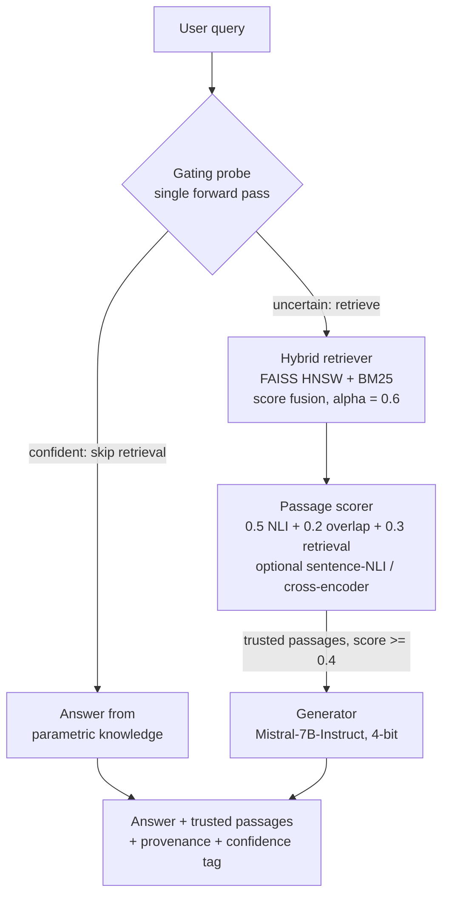

# Factuality-First RAG

**Adaptive retrieval gating + passage-level factuality scoring** — a Retrieval-Augmented Generation system that decides *whether* to retrieve before it answers, and verifies *what* it retrieved before it generates.

[](https://www.python.org/downloads/)
[](https://opensource.org/licenses/MIT)


---

## Why I built this

Standard RAG systems *always* retrieve before answering — even for questions the model already knows. That wastes compute, adds latency, and, worse, can inject irrelevant or contradictory passages that actually *increase* hallucination. On top of that, most pipelines never check whether the retrieved evidence supports the answer at all.

I built Factuality-First RAG to attack both problems with two ideas:

1. **Adaptive retrieval gating** — a *zero-cost* probe on the generator's own next-token distribution that decides whether retrieval is even needed, so the system skips it on confident, parametric-knowledge queries.
2. **Passage-level factuality scoring** — every retrieved passage is verified against the query with NLI entailment *before* the generator ever sees it, so only trusted evidence reaches the answer.

The gating probe is the piece I'm most excited about: it reads signals the model already produces, so it costs essentially nothing to run and needs no extra training.

---

## How it works

The pipeline runs in four stages and returns not just an answer but its supporting evidence, a claim-to-passage provenance map, and a calibrated confidence tag.

**1. Gating probe (one forward pass).** I look at the entropy and the top-two logit gap of the generator's next-token distribution. When the model is confident — low entropy *and* a wide logit gap — I skip retrieval and answer from parametric knowledge. When it's uncertain (`entropy > 1.2` **or** `logit_gap < 2.0`), I retrieve. An optional multi-token variant averages the signal over several positions for stability.

**2. Hybrid retriever.** Dense (FAISS HNSW over `all-mpnet-base-v2` embeddings) and sparse (Lucene BM25 via Pyserini) results are fused with per-query min-max normalisation and a tunable weight: `combined = α·dense + (1−α)·BM25`, with `α = 0.6` by default.

**3. Passage scorer.** Each candidate passage gets a trust score that fuses entailment, lexical overlap, and retrieval strength: `score = 0.5·P(entailment) + 0.2·overlap + 0.3·retrieval`, where entailment comes from a RoBERTa-large NLI model (premise = passage, hypothesis = query). Only passages scoring `≥ 0.4` are passed forward. Sentence-level NLI and a cross-encoder reranking stage are both available as options for higher precision.

**4. Generator.** A 4-bit-quantised Mistral-7B-Instruct-v0.3 produces the answer from the trusted passages using an `[INST]` RAG template. The gating probe and the generator **share the same weights** through a singleton model registry, so the 7B parameters are never loaded twice.



---

## Project status

I want to be upfront about where this stands, because it changes how to read what's below.

- ✅ **Method and infrastructure: complete and tested.** Both novel components (gating + factuality scoring), the hybrid retriever, the full evaluation harness, all baselines, and the analysis tooling are implemented, with **100+ tests** passing in mock mode (no GPU or model downloads needed).
- ✅ **Retrieval corpus: built.** A **544,953-passage** Wikipedia index is live — FAISS HNSW (768-dim, ~1.56 GB, built in ~3h25m) plus a Lucene BM25 index — and verified end-to-end on real queries.
- 🔬 **Large-scale benchmark evaluation: in progress.** The full baseline-vs-pipeline runs across the benchmark suite are the current focus. **The headline efficiency and factuality numbers below are stated as design targets, not measured results** — I'll update this section with verified numbers (and significance tests) as the runs complete.

I'd rather ship an honest research-stage README than a results table I can't yet defend.

---

## Evaluation design

I designed the evaluation to isolate the contribution of *each* component, not just to show a single end-to-end number.

**Benchmarks (7 adapters implemented).** Open-domain QA: NQ-Open, PopQA. Multi-hop QA: HotpotQA, 2WikiMultihopQA. Fact verification / grounded QA: FEVER, HAGRID. Adversarial parametric: TruthfulQA.

**Baselines (ablation ladder).** Closed-book (no retrieval) · Always-RAG (retrieve every query) · Gate-only · Score-only · Learned-scorer · the **full pipeline**. Each isolates one mechanism so I can attribute any gain to gating, to scoring, or to their combination.

**Metrics.** Exact Match, token F1, FactScore (claim decomposition + per-claim NLI), hallucination rate, retrieval-call %, and binned Expected Calibration Error (Guo et al., 2017).

**Statistical rigour.** 3 seeds per configuration, with a paired bootstrap significance test (n = 1,000) for headline comparisons.

**Targets I'm evaluating against** *(hypotheses, not yet measured)*: a FactScore improvement of **+5–10 points** over Always-RAG, at **≤5% EM degradation**, while cutting retrieval calls by **30–50%**.


---

## Engineering highlights

These are the concrete, verified numbers the project stands on today:

| What | Detail |
|------|--------|
| **Retrieval scale** | **544,953** Wikipedia passages indexed (FAISS HNSW + Lucene BM25) |
| **Dense index** | 768-dim, **~1.56 GB**, ~3h25m build |
| **Generator** | Mistral-7B-Instruct-v0.3, **4-bit quantised** (bitsandbytes) |
| **Shared weights** | Singleton model registry — gating + generation never double-load the 7B model |
| **Tests** | **100+** unit tests, full mock mode (runs without GPU / downloads) |
| **Pipeline** | Load-once `Pipeline` class for efficient batch experiments |
| **Analysis tooling** | Gating-oracle analysis, scorer-AUC analysis, error taxonomy, weight grid-search, cross-seed aggregation, paired bootstrap |
| **Quality tooling** | `pytest` + `ruff` + `mypy`, configured in `pyproject.toml` |

---

## Tech stack

| Layer | Technologies |
|-------|--------------|
| **Language** | Python 3.9+ |
| **Generator** | Mistral-7B-Instruct-v0.3, 4-bit (bitsandbytes) |
| **NLI** | RoBERTa-large (SNLI + MNLI + FEVER + ANLI) |
| **Embeddings** | sentence-transformers / `all-mpnet-base-v2` |
| **Dense index** | FAISS (HNSW Flat / IVF-PQ) |
| **Sparse index** | Pyserini (Lucene BM25) |
| **Datasets** | HuggingFace Datasets (NQ-Open, HotpotQA, FEVER, TruthfulQA, PopQA, HAGRID, 2WikiMultihopQA) |
| **Tooling** | pytest, ruff, mypy |
| **Build** | setuptools + `pyproject.toml` |

---

## Requirements

| Resource | Minimum | Recommended |
|----------|---------|-------------|
| **Python** | 3.9 | 3.11+ |
| **RAM** | 8 GB | 16 GB |
| **GPU** | — (mock mode works on CPU) | NVIDIA A100-80 GB / RTX 4090 (24 GB) |
| **Disk** | 500 MB (code only) | ~20 GB (with models + indexes) |
| **OS** | Linux, macOS, Windows | Ubuntu 22.04 / Windows 11 |

---

## Quickstart

The whole thing runs in **mock mode on CPU** — no GPU, no model downloads — so you can explore the pipeline end-to-end in seconds.

```bash
# 1. Clone
git clone https://github.com/pes1ug23am910/Factuality-First-RAG.git
cd Factuality-First-RAG

# 2. Virtual environment
python -m venv .venv
source .venv/bin/activate        # Linux / macOS
# .venv\Scripts\activate         # Windows

# 3. Install
pip install -e ".[dev]"

# 4. Run the demo (no GPU required)
python scripts/demo.py

# 5. Run the test suite (mock mode, no downloads)
pytest tests/ -v -m "not integration"
```

### Models for real inference

Models are **not** committed to this repository. For real (non-mock) inference they auto-download from the HuggingFace Hub on first run — budget ~15 GB of disk and a CUDA-capable GPU:

```
mistralai/Mistral-7B-Instruct-v0.3                          (~4 GB quantised)
ynie/roberta-large-snli_mnli_fever_anli_R1_R2_R3-nli        (~1.4 GB)
sentence-transformers/all-mpnet-base-v2                      (~420 MB)
```

### CLI

```bash
# Build a Wikipedia corpus + indexes (mock-mode shown)
python -m factuality_rag.cli chunk_wiki --output data/wiki_chunks.jsonl \
    --chunk-size 200 --chunk-overlap 50 --dev-sample-size 50 --mock-mode
python -m factuality_rag.cli build_index --corpus data/wiki_chunks.jsonl \
    --faiss-out indexes/faiss.index --pyserini-out indexes/pyserini_dir \
    --dev-sample-size 50 --mock-mode

# Answer a single query
python -m factuality_rag.cli run --query "What is the capital of France?" --k 10 --mock-mode

# Evaluate predictions
python -m factuality_rag.cli evaluate --predictions runs/<run-id>/predictions.jsonl
```

### Python API

```python
from factuality_rag.pipeline.orchestrator import Pipeline

# Load every component once
pipe = Pipeline(config_path="configs/exp_sample.yaml", mock_mode=True)

# Run on any query
answer, passages, provenance, confidence = pipe.run("What is the capital of France?")
print(f"Answer: {answer}  (confidence: {confidence})")
```

---

## Configuration

Every hyperparameter lives in YAML configs under `configs/` (one per benchmark, plus the baseline ablations `exp_b1`–`exp_b5` and `exp_full_pipeline`).

| Parameter | Default | Meaning |
|-----------|---------|---------|
| `retriever.alpha` | 0.6 | Dense vs. sparse fusion weight |
| `gating.entropy_threshold` | 1.2 | Uncertainty threshold for retrieval |
| `gating.logit_gap_threshold` | 2.0 | Confidence-gap threshold |
| `gating.probe_tokens` | 1 | Positions averaged in the multi-token probe |
| `scorer.score_threshold` | 0.4 | Minimum passage trust score |
| `scorer.w_nli / w_overlap / w_ret` | 0.5 / 0.2 / 0.3 | Scorer fusion weights |
| `scorer.nli_mode` | `"passage"` | `"passage"` or `"sentence"` |
| `scorer.cross_encoder_model` | `null` | Optional reranker model ID |

---

## Repository structure

```
factuality_rag/
├── model_registry.py        # Singleton model cache (4-bit quant, shared weights)
├── data/
│   ├── loader.py            # HuggingFace dataset adapters (7 benchmarks)
│   └── wikipedia.py         # Wikipedia chunking: offline + HF streaming
├── index/builder.py         # FAISS (HNSW / IVFPQ) + Pyserini collection builder
├── retriever/hybrid.py      # Hybrid dense+sparse retrieval with score fusion
├── gating/probe.py          # Adaptive gating: entropy + logit gap + multi-token probe + ECE
├── scorer/
│   ├── passage.py           # NLI + overlap + retrieval fusion, sentence-NLI, cross-encoder
│   └── learned_scorer.py    # Optional learned scorer (LogReg / MLP)
├── generator/wrapper.py     # Mistral-7B with [INST] RAG templates
├── pipeline/orchestrator.py # run_pipeline() + load-once Pipeline class + provenance
├── eval/metrics.py          # EM, F1, FactScore (claim decomposition + NLI)
├── cli/__main__.py          # CLI: chunk-wiki, build-index, run, evaluate
└── experiment_runner.py     # Batch experiment runner with metadata tracking

configs/   # YAML experiment configs (benchmarks + baseline ablations B1–B5, full)
scripts/   # Analysis & experiment tools (gating, scorer, errors, tuning, bootstrap, demo)
docs/      # Architecture, API reference, experiment plan, session logs
tests/     # 100+ unit tests (mock mode) + GPU-only integration tests
```

---

## Excluded assets

The following are **not** committed to this repository (see `.gitignore`), but every one is fully reproducible from the source code and public model hubs:

| Asset | Size | How to obtain |
|-------|------|---------------|
| LLM weights (Mistral-7B) | ~4 GB | Auto-downloads via HuggingFace on first run |
| NLI model (RoBERTa-large) | ~1.4 GB | Auto-downloads via HuggingFace on first run |
| Embedding model | ~420 MB | Auto-downloads via HuggingFace on first run |
| FAISS / Lucene indexes | Variable | Generated by the `build_index` CLI command |
| Wikipedia corpus chunks | Variable | Generated by the `chunk_wiki` CLI command |

---

## Documentation

| Document | Description |
|----------|-------------|
| [`docs/ARCHITECTURE.md`](docs/ARCHITECTURE.md) | Detailed system architecture and data flow |
| [`docs/API_REFERENCE.md`](docs/API_REFERENCE.md) | Complete API reference for all modules |

---

## Roadmap

- Complete the full benchmark sweep and replace the targets above with verified results + significance tests
- Add a GitHub Actions CI workflow (the local `pytest`/`ruff`/`mypy` checks are already configured)
- Ship a live demo (Gradio / HF Spaces) for the gating + scoring flow
- Add a Self-RAG baseline and a DPR/Contriever encoder comparison

---

## Author

**Yash Verma** — PES University (PES1UG23AM910)

## License

Released under the MIT License.
